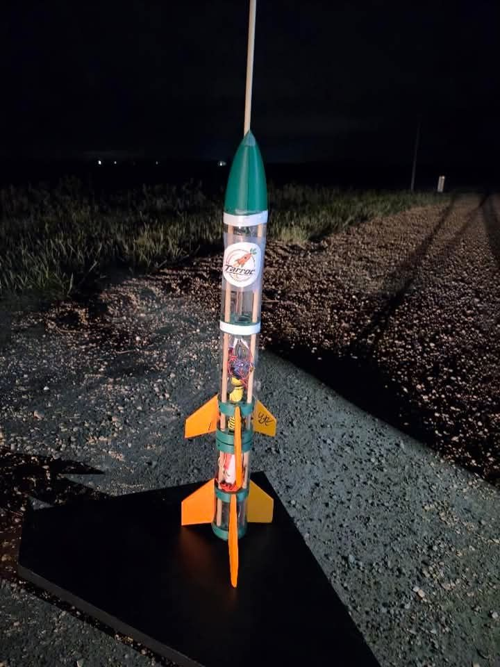
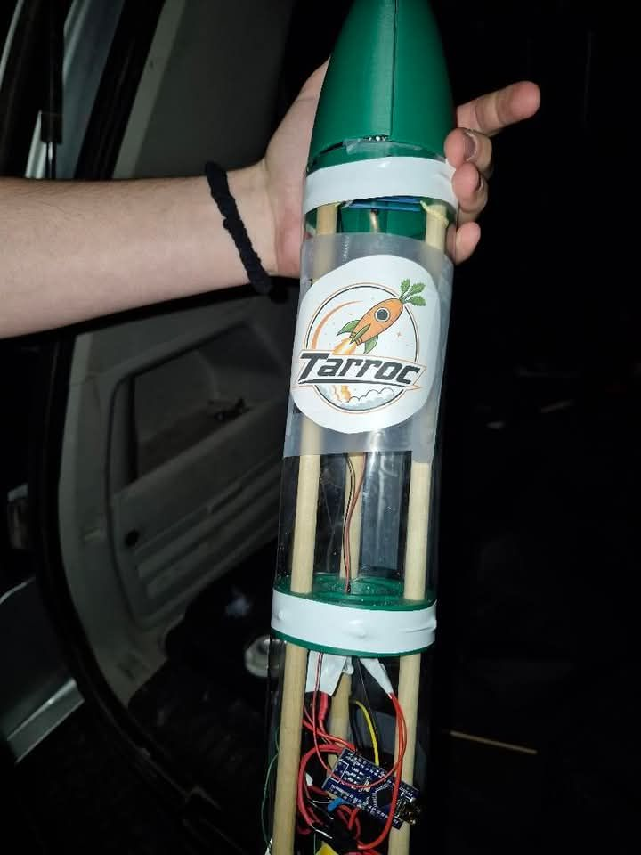
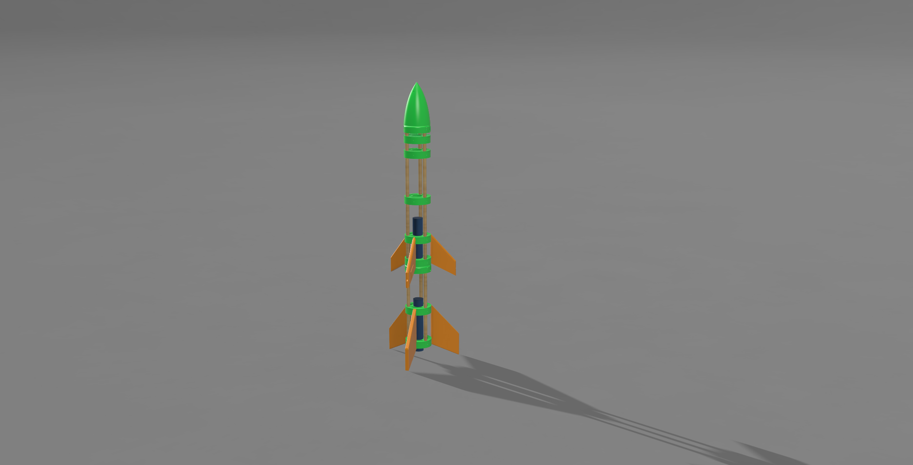
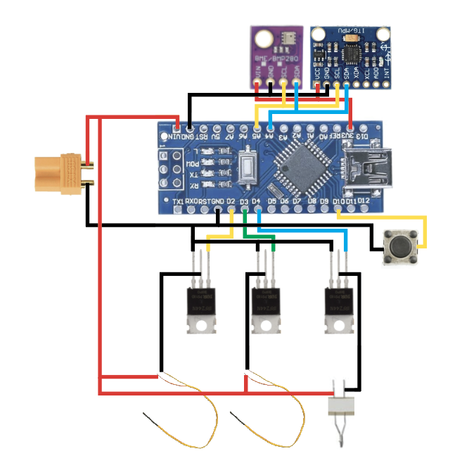

  

 

# TARROC
The Tarroc (carrot inverted) is a 2 stage model roket powered by 2 G38-4FJ rocket engines for each stage featuring a arduino based flight computer with a barometer and gyroscope log 

The flight computer features 3 mosfets, each mosfet is wired up to its respective igniter
- Lower Stage
- Upper Stage 
- Parachute Deploy

## IRL Build

## Launch

https://github.com/user-attachments/assets/ba41ea99-5bd1-47af-b8f5-e896b838b2ae

## Render

## Schematic

## BOM

### Components List

| **Name** | **Purpose** | **Quantity** | **Total Cost** | **Distributor** | **Link** |
|---|---|---:|---:|---|---|
| **ARDUINO NANO** | Brain | 1 | $3.08 | AliExpress | [Link](https://www.aliexpress.com/item/1005006472755752.html) |
| **BMP280** | Barometer | 1 | $5.52 | AliExpress | [Link](https://www.aliexpress.com/item/1005008511564094.html) |
| **MPU6050** | Accelerometer | 1 | $2.64 | AliExpress | [Link](https://www.aliexpress.com/item/1005006104263942.html) |
| **IRLZ44N** | MOSFETs | 10 | $2.61 | AliExpress | [Link](https://www.aliexpress.com/item/1005009242758699.html) |
| **XT30** | Battery plug | 10 | $3.37 | AliExpress | [Link](https://www.aliexpress.com/item/1005007257783857.html) |
| **22AWG WIRE** | Black and red wire, 5 meters | 1 | $3.44 | AliExpress | [Link](https://www.aliexpress.com/item/1005008409314314.html) |
| **Buttons** | Buttons | 50 | $5.09 | AliExpress | [Link](https://www.aliexpress.com/item/1005012637969465.html) |
| **WOOD RODS** | Support | 10 | $2.78 | AliExpress | [Link](https://www.aliexpress.com/item/1005005515488821.html) |
| **SCREWS** | M2 × 14 mm | 50 | $1.74 | AliExpress | [Link](https://www.aliexpress.com/item/32969042589.html) |
| **PVC SHEET** | 200 × 300 × 0.5 mm | 3 | $15.05 | AliExpress | [Link](https://www.aliexpress.com/item/1005006872503220.html) |
| **2S LIPO** | 580 mAh 2S LiPo battery | 1 | $17.17 | AliExpress | [Link](https://www.aliexpress.com/item/1005009708702635.html) |
| **HEAT SHRINK** | Heat-shrink tubing | 164 | $2.84 | AliExpress | [Link](https://www.aliexpress.com/item/1005008146302901.html) |
| **NYLON FABRIC** | Nylon parachute fabric, 1 yard | 1 | $4.65 | AliExpress | [Link](https://www.aliexpress.com/item/1005003032143116.html) |
| **EPOXY** | Epoxy resin | 1 | $4.79 | AliExpress | [Link](https://www.aliexpress.com/item/1005009336504246.html) |
| **Components Subtotal** | | | **$74.73** | | |

### Rocket Motor and Recovery System

| **Name** | **Purpose** | **Quantity** | **Total Cost** | **Distributor** | **Link** |
|---|---|---:|---:|---|---|
| **G38-4FJ Rocket Motor** | Rocket engines | 2 | $99.00 | Canadian Rocket Store | [Link](https://www.allrockets.ca/G38-4) |
| **CHUTE PROTECTOR** | 4 × 4 chute protector | 1 | $7.40 | Canadian Rocket Store | [Link](https://www.allrockets.ca/Build/Shock-Cords/Kevlar-220) |
| **KEVLAR CORD** | 10 ft, 1.2 mm (250 lbs) | 1 | $3.70 | Canadian Rocket Store | [Link](https://www.allrockets.ca/Accessories/Chute-Protector-4) |

### Additional Costs

| **Name** | **Purpose** | **Quantity** | **Total Cost** | **Distributor** |
|---|---|---:|---:|---|
| **Taxes** | AliExpress tax | — | $8.40 | AliExpress |
| **Shipping** | Standard shipping | — | $24.06 | Canadian Rocket Store |
| **Taxes** | Sales tax | — | $6.71 | Canadian Rocket Store |

**Grand Total Project Estimate Cost: $224.04**
